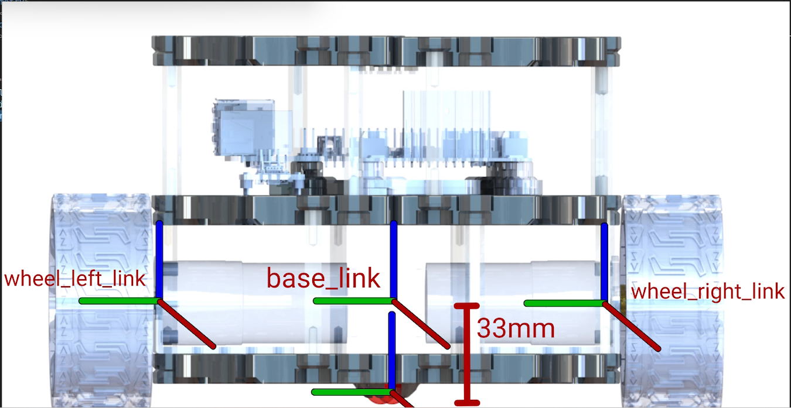
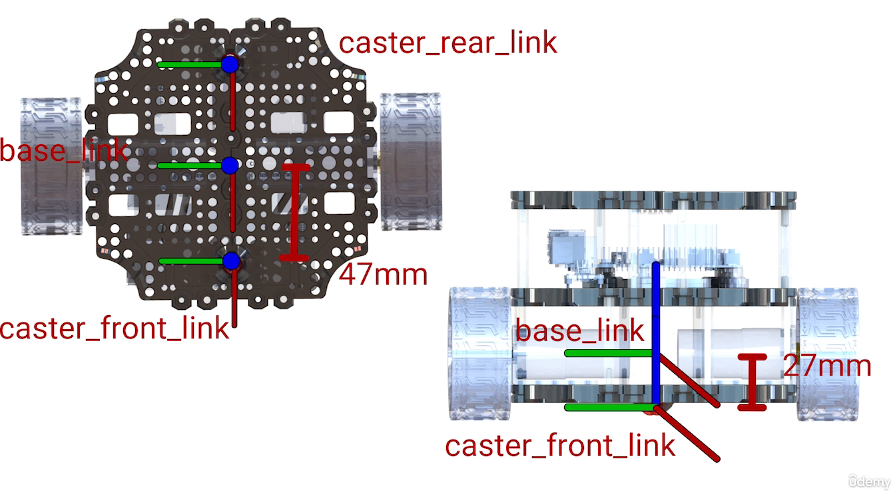

#### Robot model




#### Sử dụng lệnh này để kiểm tra mô hình robot urdf trong Rviz
```bash
ros2 launch urdf_tutorial display.launch.py model:=robot_ws/src/bumblebee_description/urdf/bumblebee.urdf.xacro
```
